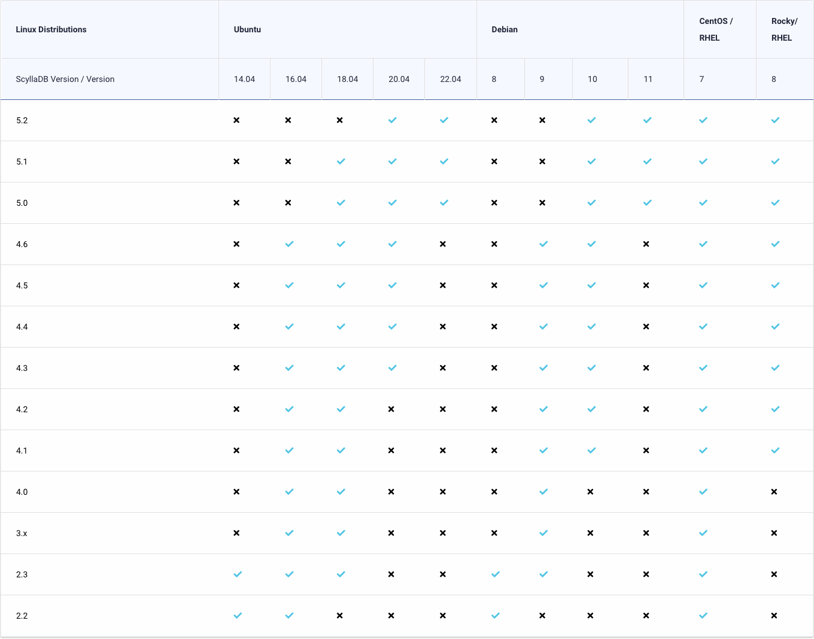

## 按Linux发行版和版本划分的操作系统支持

以下描述了哪些版本的ScyllaDB支持哪些Linux发行版、容器和镜像

### ScyllaDB开源版本

提示：推荐用于ScyllaDB开源版本的操作系统是Ubuntu 22.04

所有版本都以Docker容器、EC2 AMI和GCP镜像（版本4.3中的GCP镜像）的形式提供。从 5.2版本开始，ScyllaDB开源版本AMI/镜像操作系统都基于Ubuntu 22.04

### ScyllaDB企业版

提示：推荐用于ScyllaDB企业版的操作系统是Ubuntu 22.04

所有版本都以Docker容器、EC2 AMI和GCP镜像（版本4.3中的GCP镜像）的形式提供。从2023.1版本开始，ScyllaDB企业版AMI/镜像操作系统都基于Ubuntu 22.04